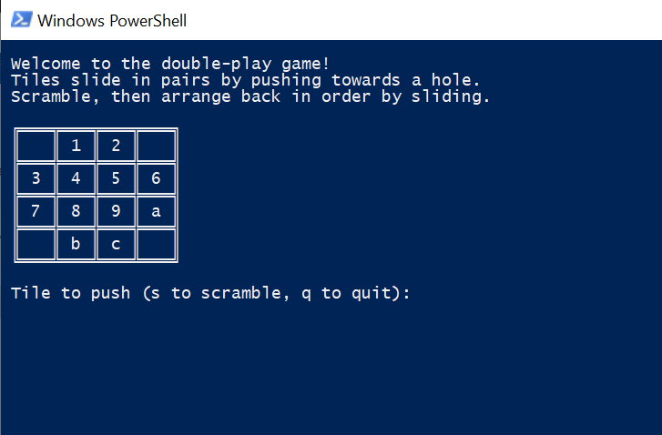

# Push Tile Game

This game consists of a 4 X 4 grid with 12 labelled tiles and 4 blank tiles. Click the 's' key on your keyboard to scramble the tiles, then enter tile values into your keyboard to push tiles in pairs around the board. The goal of the game is to get the tiles back into their original ordered state (pictured in the screenshot below). Tiles can only be push towards empty spaces, and can only be pushed in pairs. 

To run the tile game on a Windows OS: 
- From https://dotnet.microsoft.com/download download the .NET Framework Dev Pack
- Clone this repository to your local computer
- Open a Windows Powershell terminal in the pushTileGame directory
- Run the "dotnet run" command
- Expected output is shown below

To run on Mac/Linux:
- This has not been tested, however as laid out in the project file, running this code relies on the Microsoft.NET SDK, specifically the netcoreapp2.1 Framework
- Find a version here https://dotnet.microsoft.com/download which is supported on your OS and try the steps above in your system's terminal instead of Powershell
